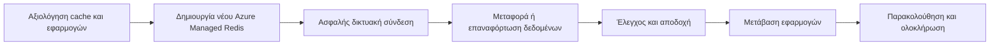

# Πρόταση Μετάβασης σε Azure Managed Redis

## Σκοπός

Προτείνουμε τη σταδιακή μετάβαση των υφιστάμενων Azure Cache for Redis instances σε Azure Managed Redis στη West Europe. Η μετάβαση θα ενισχύσει τη μακροχρόνια υποστήριξη, την ασφάλεια και την ανθεκτικότητα της Redis υπηρεσίας, με ελεγχόμενη μετάβαση των εφαρμογών και ελαχιστοποίηση επιχειρησιακού κινδύνου.

Το αρχικό inventory περιλαμβάνει επτά caches. Η τελική λίστα και η σειρά μετάβασης θα επιβεβαιωθούν μαζί σας πριν ξεκινήσει η υλοποίηση.

## Τι θα παραδώσουμε

- Νέα Azure Managed Redis instances, διαστασιολογημένα σύμφωνα με τη χρήση κάθε workload.
- Ιδιωτική και ασφαλή συνδεσιμότητα για τις εφαρμογές μέσω της υφιστάμενης δικτυακής αρχιτεκτονικής.
- Υψηλή διαθεσιμότητα για τα QA και Production workloads.
- Μεταφορά ή ελεγχόμενη επαναφόρτωση των δεδομένων, ανάλογα με τον ρόλο κάθε cache.
- Έλεγχο συνδεσιμότητας, βασικών λειτουργιών και αποτελεσμάτων πριν από κάθε παραγωγική μετάβαση.
- Τεκμηριωμένο σχέδιο cutover και rollback για κάθε cache.

## Προτεινόμενη προσέγγιση

Η υλοποίηση θα προχωρήσει σε κύματα, ξεκινώντας από Test και Development, ακολουθούμενα από QA και Production. Με αυτόν τον τρόπο επιβεβαιώνουμε τη διαδικασία και τις εφαρμογές σε περιβάλλοντα χαμηλότερου κινδύνου πριν από κάθε παραγωγική αλλαγή.

| Φάση | Περιβάλλον | Στόχος |
| --- | --- | --- |
| 1 | Test | Επιβεβαίωση της διαδικασίας μετάβασης και της συμβατότητας εφαρμογών. |
| 2 | Development | Εφαρμογή των επιβεβαιωμένων ρυθμίσεων σε περιβάλλον ανάπτυξης. |
| 3 | QA | Ολοκληρωμένοι λειτουργικοί και επιχειρησιακοί έλεγχοι. |
| 4-5 | Production | Ελεγχόμενο cutover ανά cache, με παρακολούθηση και δυνατότητα rollback. |

## Πώς διαχειριζόμαστε τον κίνδυνο

- Κάθε cache αξιολογείται πριν από τη μετάβαση ως προς τη χρήση, τον όγκο δεδομένων και τις ανάγκες διαθεσιμότητας.
- Για caches που μπορούν να αναδημιουργηθούν από το source system, επιλέγουμε ελεγχόμενη επαναφόρτωση. Για κρίσιμα δεδομένα εφαρμόζουμε κατάλληλη διαδικασία μεταφοράς και συμφωνίας αποτελεσμάτων.
- Η αλλαγή των εφαρμογών γίνεται μόνο μετά από επιτυχή τεχνικό και λειτουργικό έλεγχο.
- Διατηρούμε το υφιστάμενο cache διαθέσιμο για συμφωνημένο διάστημα rollback μετά από κάθε cutover.
- Οι παραγωγικές αλλαγές προγραμματίζονται σε συμφωνημένο change window.

## Ρόλοι και ευθύνες

| Δική μας ευθύνη | Δική σας ευθύνη |
| --- | --- |
| Provisioning των νέων Azure Managed Redis resources και ασφαλούς συνδεσιμότητας. | Επιβεβαίωση της τελικής λίστας caches και των επιχειρησιακών προτεραιοτήτων. |
| Σχεδιασμός και εκτέλεση της διαδικασίας μεταφοράς δεδομένων. | Παροχή application owners και συμμετοχή στους λειτουργικούς ελέγχους. |
| Τεχνικοί έλεγχοι, παρακολούθηση cutover και τεκμηρίωση rollback. | Ενημέρωση των application configurations προς το νέο endpoint. |
| Παράδοση τεκμηρίωσης για κάθε ολοκληρωμένο cache. | Τελική αποδοχή και deprovisioning του παλιού cache μετά την επιτυχή μετάβαση. |

## Κριτήρια επιτυχίας

Μια μετάβαση θεωρείται ολοκληρωμένη όταν οι εφαρμογές συνδέονται επιτυχώς στο νέο service, οι συμφωνημένοι λειτουργικοί έλεγχοι έχουν περάσει, τα δεδομένα έχουν επαληθευτεί όπου απαιτείται και η περίοδος παρακολούθησης έχει ολοκληρωθεί χωρίς ουσιώδη προβλήματα.

## Επόμενα βήματα

1. Επιβεβαίωση των caches που θα μεταφερθούν και της επιχειρησιακής προτεραιότητάς τους.
2. Ορισμός application owners, change windows και κριτηρίων αποδοχής.
3. Έναρξη του πρώτου Test migration wave και αξιολόγηση αποτελεσμάτων πριν από το επόμενο κύμα.
