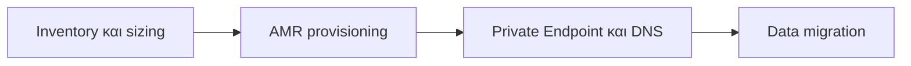

# Azure Managed Redis - Συνοπτικό Σχέδιο Μετάβασης

| Στοιχείο | Απόφαση |
| --- | --- |
| Στόχος | Μετάβαση 7 Azure Cache for Redis instances σε Azure Managed Redis (AMR) |
| Περιοχή | West Europe |
| Διαδρομή | Self-service migration σε πέντε waves |
| Δικό μας scope | Provisioning AMR, data migration, Private Endpoint/VNet/DNS integration

> **Σύσταση:** δημιουργούμε, δικτυώνουμε και δοκιμάζουμε το νέο AMR πριν αλλάξει οποιοδήποτε production endpoint. Επιλέγουμε data strategy ανά workload και διατηρούμε το legacy cache ως rollback target.

## Οι στόχοι μας

| Wave | Source cache | Current | Initial AMR candidate | Στρατηγική |
| --- | --- | --- | --- | --- |
| 1 | `redis-cytaweb-test-standard-we-02` | Standard, 1 GB | Balanced B1 | Cold start ή programmatic rehearsal |
| 1 | `redis-cytaweb-test-v6` | Standard, 1 GB | Balanced B1 | Cold start ή programmatic rehearsal |
| 2 | `redis-cytaweb-dev-we-01` | Standard, 1 GB | Balanced B1 | Cold start όπου είναι rehydratable |
| 3 | `redis-cytaweb-qa`, `redis-cytaweb-qa-we-01` | Standard, 1 GB | Balanced B1, HA | Production-like rehearsal |
| 4 | `redis-cytaweb-premium-prod` | Premium, 6 GB | Balanced B5, HA | RDB + freeze ή dual write |
| 5 | `redis-cytaweb-prod-we-01` | Premium, 6 GB | Balanced B5, HA | RDB + freeze ή dual write |

Οι B1/B5 είναι αρχικές υποθέσεις. Επιβεβαιώνονται με 30 ημέρες μετρικών και load test.

## Οι κρίσιμες αλλαγές

| Θέμα | Legacy cache | AMR | Ενέργεια |
| --- | --- | --- | --- |
| Runtime | OSS Redis | Redis Enterprise | Load test: περισσότερα shards/vCPU δεν σημαίνουν αυτόματα ίδιο workload behavior. |
| Redis version | 6.x | 7.4 | Έλεγχος clients, Lua, multi-key commands και deprecated behavior. |
| Clustering | Standard nonclustered, Premium optional | Clustered by default | Cluster-aware client, `MOVED` redirects και hash tags. |
| Network | Private Link ή VNet injection | Private Link, όχι VNet injection/IP firewall | Νέο Private Endpoint και private DNS. |
| Database | Πολλαπλά logical DB | Μόνο database 0 | `SELECT` αντικαθίσταται με key prefixes. |
| TLS | Ports 6380/6379, ταυτόχρονα modes | Port 10000, ένα mode | TLS ως default· ενημέρωση όλων των connection strings. |
| Events/reboot | Keyspace notifications, manual reboot | Δεν υπάρχουν | Application-level event replacement· Flush μόνο στο target. |

## Αποφάσεις provisioning

1. **Sizing:** το AMR κρατά περίπου 20% για system overhead.

   $$\text{AMR total memory} \geq \frac{\text{peak usable memory}}{0.80}$$

2. **Tier:** Balanced αρχικά, Memory Optimized όταν η μνήμη είναι bottleneck, Compute Optimized όταν CPU/bandwidth/latency είναι bottleneck.
3. **HA:** ενεργό σε QA και Production. Non-HA μόνο για ανακτήσιμο Test/Dev.
4. **Cluster policy:** OSS για καλύτερη throughput/latency, Enterprise μόνο για RediSearch ή legacy-client constraint. Nonclustered μόνο ως εξαίρεση έως 25 GB.
5. **Authentication:** Entra ID/managed identity όπου υποστηρίζεται· access key μόνο μεταβατικά.
6. **Modules/persistence:** αποφασίζονται πριν το create. Modules δεν προστίθενται αργότερα στο ίδιο instance.

## Network και compatibility gates

- Δημιουργούμε Private Endpoint και συνδέουμε private DNS zone στα VNet των workloads.
- Δοκιμάζουμε name resolution και TCP/TLS connectivity από κάθε App Service, AKS, VM και on-premises route.
- Ελέγχουμε `MOVED`, `CROSSSLOT`, reconnect, TLS/auth, `SELECT <db>`, Lua, pipelines, `MULTI/EXEC` και keyspace-event dependencies.
- Για related multi-key data χρησιμοποιούμε hash tags: `{order:123}:header`, `{order:123}:items`.
- AMR δεν υποστηρίζει keyspace notifications. Αντικαθιστούμε subscriptions σε `__keyspace@*__` και `__keyevent@*__`.

## Επιλογή data migration

| Workload | Μέθοδος | Κύριος κίνδυνος / έλεγχος |
| --- | --- | --- |
| Cache-aside | Cold start και cache warming | Προστασία origin datastore από miss storm |
| Premium, point-in-time data | RDB export/import | Writes μετά το snapshot χρειάζονται freeze ή dual write |
| Sessions/queues/critical state | Dual write | Idempotency, conflict policy, reconciliation |
| Ειδικό/μεγάλο dataset | Programmatic copy (RIOT-X) | Cluster-aware tool, TLS, VM ίδιας περιοχής |

Το built-in migration tooling είναι preview και **δεν** μεταφέρει data. Δεν υποστηρίζει Private Endpoint, VNet injection ή geo-replication, και επηρεάζει όλους τους clients μαζί. Δεν είναι η βασική μας διαδρομή.

## Gates ανά wave

| Wave | Gate εξόδου |
| --- | --- |
| Test | Integration tests green, χωρίς `MOVED`/`CROSSSLOT` errors |
| Dev | Repeatable provisioning και rollback rehearsal |
| QA | Load test, HA reconnect, DNS και data reconciliation green |
| Production 1 | Hypercare 48-72 ώρες εντός SLO |
| Production 2 | Επανάληψη αποδεδειγμένου runbook |

## Cutover και rollback

**Πριν από cutover:** AMR SKU/HA/policy/TLS, Private Endpoint/DNS, application config, data reconciliation και baseline metrics έχουν επικυρωθεί.

**Κατά hypercare:** παρακολουθούμε error rate, P95/P99 latency, connections, throughput, used memory, evictions και business flows.

**Rollback trigger:** sustained SLO breach, `MOVED`/`CROSSSLOT`, TLS/auth failure, data inconsistency ή cache-miss storm.

1. Παγώνουμε νέο traffic προς AMR.
2. Επιστρέφουμε feature flag/configuration στο legacy endpoint.
3. Ελέγχουμε reconnect και κρίσιμα flows.
4. Κάνουμε reconciliation για AMR-only writes πριν από νέο attempt.

## Πηγές

- [Azure Managed Redis migration: understand](https://learn.microsoft.com/en-us/azure/redis/migrate/migrate-basic-standard-premium-understand)
- [Migration options](https://learn.microsoft.com/en-us/azure/redis/migrate/migrate-basic-standard-premium-options)
- [Self-service migration](https://learn.microsoft.com/en-us/azure/redis/migrate/migrate-basic-standard-premium-self-service)
- [Migration tooling preview](https://learn.microsoft.com/en-us/azure/redis/migrate/migrate-basic-standard-premium-with-tooling)
- [AMR architecture](https://learn.microsoft.com/en-us/azure/redis/architecture)
